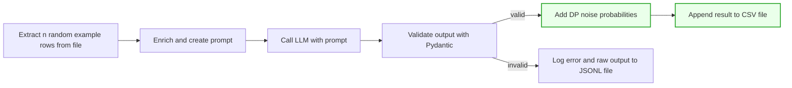

# Synthatic data generation with Differential Privacy
Multiprocessing pipeline with the Producer/Consumer pattern for synthetic tabular data generation with LLMs. Uses Hugging Face + LangChain to build prompts from seed data, generate rows, apply differential privacy sampling, and write results to CSV with optional JSONL logging. Supports multi-GPU execution.

⚠️ Note: This repository is provided as an example implementation only.
It is not a polished production system 
— you may need to adapt, extend, or harden it for your own use cases.

### DP Pipeline Overview

